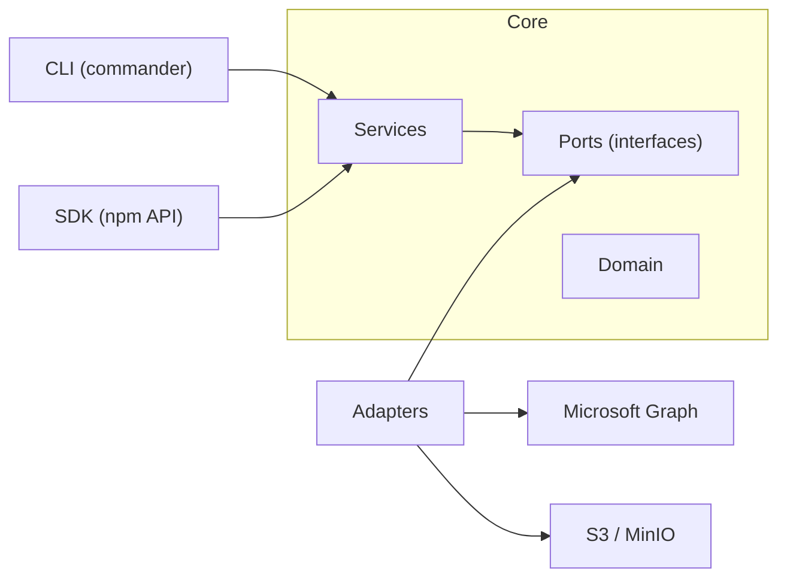

<!-- Created with GitHub Repo Banner by Waren Gonzaga: https://ghrb.waren.build -->

[](https://github.com/miikaok/atlas/actions/workflows/ci.yml)
[](https://github.com/miikaok/atlas/actions/workflows/ci.yml)
[](https://www.npmjs.com/package/m365-atlas)
[](./LICENSE)
[](https://socket.dev/npm/package/m365-atlas)

An open-source CLI backup and restore engine for Microsoft 365 mailboxes. Built with per-tenant envelope encryption, content-addressed deduplication, multi-layer integrity validation, and efficient delta synchronization for scalable, secure operations against S3-compatible object storage.

## Highlights

🔐 **Per-tenant encryption** — Each tenant gets a unique AES-256-GCM key derived via scrypt. Even if storage is breached, data stays encrypted and requires that tenant's passphrase to decrypt.

🧊 **Storage-level immutability (WORM)** — S3/MinIO Object Lock with time-based retention enforced by storage itself, not app metadata.

🧬 **Content-addressed deduplication** — Messages and attachments are stored by SHA-256 hash per mailbox. Identical files are stored once.

📎 **Attachment backup & restore** — Attachments are fetched via Graph API, deduplicated, and encrypted with message data. Large files use chunked upload sessions during restore.

🛡️ **Multi-layer integrity checks** — SHA-256 in manifests, Content-MD5 on uploads, and AES-GCM auth tags ensure transport and at-rest integrity.

🔄 **Delta sync with fallback** — Microsoft Graph delta queries for incremental backups with automatic full-scan fallback on interrupted runs.

📨 **EML export** — Save backed-up emails as standard `.eml` files in compressed zip archives with Outlook-compatible folder structure and SHA-256 verification.

📊 **Live progress dashboard** — ANSI dashboard shows all folders in real time with ETA, speed, and per-folder status. Tenant-wide backups show concurrent worker progress.

🔍 **Delta-based status check** — Peek at Graph delta state to report whether a mailbox backup is current, without running a backup.

🧩 **Typed SDK** — Programmatic API for embedding in other Node.js applications via `m365-atlas/sdk`.

🏗️ **Hexagonal architecture** — Ports-and-adapters with dependency injection. Swap storage or mail connectors without touching core logic.

## Architecture



```
src/
├── adapters/
│   ├── keystore/          # envelope encryption (AES-256-GCM, scrypt KEK)
│   ├── m365/              # Microsoft Graph connector (delta sync, OAuth2, restore)
│   ├── storage-s3/        # S3 object storage, manifest repo, bucket manager
│   └── tenant-context.factory.ts
├── cli/
│   └── commands/          # backup, list, read, verify, restore, save, delete, status, mailboxes
├── domain/                # Manifest, Snapshot, Tenant, BackupObject (pure data)
├── ports/                 # ObjectStorage, MailboxConnector, RestoreConnector, ManifestRepository, KeyService
├── services/              # MailboxSyncService, RestoreService, SaveService, CatalogService, helpers
└── utils/                 # config loader, logger
```

## Quick start

```bash
# install
npm install -g m365-atlas

# start MinIO (or use any S3-compatible endpoint)
cd docker && docker compose up -d

# configure
cp .env.example .env
# fill in tenant_id, client_id, client_secret, s3 credentials, encryption passphrase

# first backup (single mailbox)
atlas backup --mailbox user@company.com

# full tenant backup (all licensed mailboxes in parallel)
atlas backup

# check if a mailbox is up to date (fast, no backup runs)
atlas status -m user@company.com

# list tenant mailboxes from Graph
atlas mailboxes

# list what was backed up
atlas list

# restore a folder from backup
atlas restore -m user@company.com -f Inbox

# save as EML zip archive
atlas save -m user@company.com -o backup.zip
```

> **Full CLI and SDK reference:** See [docs/USAGE.md](./docs/USAGE.md) for complete command options, examples, and programmatic API documentation.

## Configuration

Atlas loads configuration from three sources, merged in this order (later wins):

1. Config file: `atlas.config.json` or `.atlas/config.json` (searched in cwd, then `~/.atlas/`)
2. `.env` file (loaded via dotenv, does not overwrite existing env vars)
3. Environment variables (always win)

| Variable                      | Config field            | Required | Description                                    |
| ----------------------------- | ----------------------- | -------- | ---------------------------------------------- |
| `ATLAS_TENANT_ID`             | `tenant_id`             | yes      | Azure AD tenant ID                             |
| `ATLAS_CLIENT_ID`             | `client_id`             | yes      | App registration client ID                     |
| `ATLAS_CLIENT_SECRET`         | `client_secret`         | yes      | App registration client secret                 |
| `ATLAS_S3_ENDPOINT`           | `s3_endpoint`           | yes      | S3 endpoint URL (e.g. `http://localhost:9002`) |
| `ATLAS_S3_ACCESS_KEY`         | `s3_access_key`         | yes      | S3 access key                                  |
| `ATLAS_S3_SECRET_KEY`         | `s3_secret_key`         | yes      | S3 secret key                                  |
| `ATLAS_S3_REGION`             | `s3_region`             | no       | S3 region (default: `us-east-1`)               |
| `ATLAS_ENCRYPTION_PASSPHRASE` | `encryption_passphrase` | yes      | Master passphrase for envelope encryption      |

## Azure AD setup

Register an application in Azure Portal with these **Application** permissions (not Delegated):

| Permission             | Why                                                     |
| ---------------------- | ------------------------------------------------------- |
| `Mail.Read`            | Read mailbox contents via Graph API                     |
| `Mail.ReadWrite`       | Restore messages and create folders in target mailboxes |
| `User.Read.All`        | Enumerate users / resolve mailbox IDs                   |
| `MailboxSettings.Read` | Read mailbox metadata and folder structure              |

> `Mail.ReadWrite` is only required for `atlas restore`. Backup, list, read, save, and verify operations work with `Mail.Read` alone.

After adding permissions, click **Grant admin consent for [your tenant]** in the API Permissions blade. The app authenticates using OAuth2 Client Credentials flow (`@azure/identity` `ClientSecretCredential`).

## Security model

Atlas uses envelope encryption to isolate tenants cryptographically:

```
Master passphrase (env var)
    |
    v
scrypt(passphrase, tenant_id, N=16384, r=8, p=1)  -->  KEK (256-bit, per-tenant)
    |
    v
KEK wraps/unwraps a random DEK (AES-256-GCM)
    |
    v
DEK encrypts all data + manifests for that tenant
```

- **KEK** (Key Encryption Key) -- derived deterministically from the passphrase and tenant ID. Never stored; re-derived on every run.
- **DEK** (Data Encryption Key) -- random 256-bit key, generated once per tenant and stored wrapped (encrypted with KEK) at `_meta/dek.enc` in the tenant's S3 bucket.
- **Ciphertext format** -- `[12-byte IV][16-byte GCM auth tag][ciphertext]`. Every encrypt operation uses a fresh random IV.
- **Manifest encryption** -- manifests (containing email subjects and message metadata) are encrypted with the same DEK, ensuring subject lines and folder names are never exposed at rest.

Integrity is validated at three layers:

| Layer     | Mechanism                           | When                               |
| --------- | ----------------------------------- | ---------------------------------- |
| Plaintext | SHA-256 checksum stored in manifest | Backup, verify, restore, save      |
| Transport | `Content-MD5` header on S3 PUT      | Upload (S3 rejects mismatches)     |
| At-rest   | AES-256-GCM authentication tag      | Every decrypt (tamper = exception) |

## Object Lock immutability

Atlas supports storage-enforced immutability on AWS S3 and MinIO.

### Enforcement model

- **Enforced by storage backend:** Object Lock retention prevents overwrite/delete based on backend rules.
- **Recorded by Atlas:** manifests include `object_lock.requested` and `object_lock.effective` for audit and operations.
- **Not enforcement:** manifest policy metadata is bookkeeping, not control-plane enforcement.

### Requirements

- Bucket must exist and be reachable.
- Bucket versioning must be enabled.
- Bucket Object Lock must be enabled/supported.

If immutable backup is requested and these checks fail, Atlas aborts with explicit error categories:

- versioning disabled
- Object Lock unsupported/disabled
- backend rejected requested mode/headers

### Deduplication + retention semantics

Atlas uses content-addressed storage (`data/{mailbox}/{sha256}`). Deduplication is identical with or without Object Lock -- if the object already exists, Atlas skips the upload. No extra storage cost, no extra S3 versions.

Object Lock **prevents** deletion during the retention window but does **not** auto-delete objects after retention expires. Since Atlas never selectively deletes individual data objects (only bulk via `delete --mailbox` or `delete --purge`), there is no risk of a manifest referencing a deleted object. Manifests are always deleted before data objects, so an interrupted deletion leaves harmless orphan data rather than dangling manifest references.

**Best-effort housekeeping rules.** When Atlas creates a new bucket, it attempts to configure lifecycle rules that work on both AWS S3 and MinIO:

| Rule | Purpose |
|------|---------|
| `AbortIncompleteMultipartUpload` (7 days) | Prevents abandoned upload parts from accumulating |
| `ExpiredObjectDeleteMarker` | Removes orphaned delete markers left after version-aware deletion |

These rules are best-effort -- if the storage backend does not support lifecycle configuration, Atlas continues without them.

### Operational notes

- `--retention-days` is required for retention-enforced immutability.
- `--lock-mode compliance` is stronger but operationally harder to reverse.
- Purge in immutable environments means "attempt full deletion and report leftovers", not guaranteed immediate destruction.

## Delta sync

Backups use Microsoft Graph [delta queries](https://learn.microsoft.com/en-us/graph/delta-query-messages) for incremental sync:

1. **Initial run** -- requests `/users/{id}/mailFolders/{id}/messages/delta` with `$select` including `body`. The API returns all messages across paginated responses. The final `@odata.deltaLink` is saved in the manifest.
2. **Subsequent runs** -- sends the saved `deltaLink`. The API returns only messages created, modified, or deleted since the last sync.
3. **Stale-delta safeguard** -- if a saved delta link returns 0 items but the previous manifest had 0 entries (indicating an interrupted prior backup), Atlas discards the link and runs a full enumeration automatically.
4. **Force full** -- `atlas backup --full` ignores all saved delta links.
5. **Graceful interruption** -- Ctrl+C during a backup sets an interrupt flag, saves all already-stored objects and completed delta links into a partial manifest, and marks interrupted folders in the dashboard.

## Storage layout

Each tenant gets its own S3 bucket named `atlas-{tenant_id}`:

```
atlas-{tenant_id}/
├── _meta/
│   └── dek.enc                         # wrapped DEK (encrypted with KEK)
├── data/
│   └── {mailbox_id}/
│       ├── {sha256_a}                  # encrypted message (content-addressed)
│       └── ...
├── attachments/
│   └── {mailbox_id}/
│       ├── {sha256_x}                  # encrypted attachment (content-addressed)
│       └── ...
└── manifests/
    └── {mailbox_id}/
        ├── {snapshot_id_1}.json        # encrypted manifest
        └── {snapshot_id_2}.json
```

## Development

```bash
pnpm install
pnpm run build          # bundle with tsdown
pnpm run test           # vitest (unit tests)
pnpm run test:coverage  # with v8 coverage
pnpm run lint           # eslint
pnpm run format         # prettier
```

### Code conventions

| Rule                                                 | Enforced by                            |
| ---------------------------------------------------- | -------------------------------------- |
| `kebab-case` file names                              | `eslint-plugin-check-file`             |
| `snake_case` variables, parameters, properties       | `@typescript-eslint/naming-convention` |
| `PascalCase` types, classes, interfaces              | `@typescript-eslint/naming-convention` |
| Max 300 lines per file (excluding blanks/comments)   | `max-lines` ESLint rule                |
| Single quotes, trailing commas, 100-char print width | Prettier                               |
| `@/` path aliases (no relative imports)              | `tsconfig.json` paths                  |
| JSDoc on all exported functions                      | Convention                             |

When a file approaches 300 lines, the logic should be split into smaller helper files rather than compacted. Each function name should describe exactly what it does without hidden side-effects; multi-responsibility functions are split into a parent that calls focused child functions.

### Testing

Tests use Vitest with `@vitest/coverage-v8`. Services are tested via Inversify container wiring with mock adapters -- no network calls in unit tests. The same DI tokens used in production are bound to mock implementations.

## Roadmap

### Completed

- [x] **Outlook mailbox backup** with delta sync, content-addressed deduplication, and attachment handling
- [x] **Outlook mailbox restore** with original timestamps, folder structure, cross-mailbox support, and chunked attachment upload
- [x] **EML export (save)** -- save backed-up emails as `.eml` files in compressed zip archives with Outlook folder structure, SHA-256 verification, and attachment embedding
- [x] **CLI interface** -- backup, restore, save, verify, list, read, delete, status, mailboxes, and storage-check commands
- [x] **S3 Object Lock / retention policies** -- GOVERNANCE and COMPLIANCE mode with storage-enforced immutability
- [x] **Typed programmatic SDK** -- `m365-atlas/sdk` subpath with camelCase ES6 API including save operations
- [x] **Tenant-wide backup orchestration** -- parallel backup of all Exchange-licensed mailboxes with rate-aware concurrency and live dashboard
- [x] **Mailbox discovery** -- enumerate tenant mailboxes from Graph with license status, creation date, and size
- [x] **Delta-based status check** -- peek at Graph delta state to determine mailbox backup freshness without running a backup
- [x] **Repository docs** -- contributing guide, issue/PR templates, code conventions

### Up next

- [ ] **Full documentation site** -- dedicated docs beyond the README with guides, API reference, and deployment examples
- [ ] **Entra ID backup** -- back up Azure AD / Entra ID directory objects (users, groups, roles, policies)
- [ ] **Entra ID restore** -- restore Entra ID objects from backup
- [ ] **OneDrive backup** -- back up OneDrive files and folder structures with delta sync
- [ ] **OneDrive restore** -- restore OneDrive files to the original or a different user
- [ ] **SDK coverage for new services** -- expose Entra ID and OneDrive operations through `m365-atlas/sdk`

## Contributing

See [CONTRIBUTING.md](./CONTRIBUTING.md) for setup instructions, code conventions, architecture overview, and pull request guidelines.

## License

Copyright 2026 Miika Oja-Kaukola

This project is licensed under the Apache License, Version 2.0.  
See the [LICENSE](./LICENSE) file for details.
