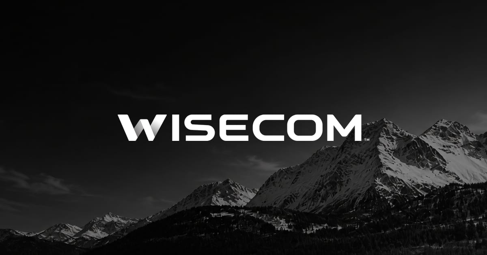

[](https://wisecom.fi)

[](https://github.com/wisecom-oy/atlas/actions/workflows/ci.yml)
[](https://github.com/wisecom-oy/atlas/actions/workflows/e2e.yml)
[](https://github.com/wisecom-oy/atlas/actions/workflows/ci.yml)
[](https://www.npmjs.com/package/@wisecom/atlas-cli)
[](./LICENSE)

# Atlas

**An open-source backup and recovery engine for Microsoft 365.**

Atlas backs up Outlook mailboxes, OneDrive files, and SharePoint document libraries into S3-compatible object storage that you control. Data is encrypted per tenant before it leaves the process, stored content-addressed and deduplicated, and synchronised incrementally through Microsoft Graph delta queries.

It is infrastructure rather than a desktop backup app: a CLI and a typed SDK, built to be automated, inspected, and operated by the people responsible for recovery. Atlas is free and open source under Apache-2.0, maintained by [Wisecom Oy](https://wisecom.fi). You can run it yourself, indefinitely, with no licence key and no feature gating.

## Why it is built this way

Recovery is only useful if it still works when the production environment cannot be trusted. That shapes the architecture:

| Property | How it works | Why it matters |
| --- | --- | --- |
| **Per-tenant encryption** | AES-256-GCM envelope encryption; a scrypt-derived key wraps a per-tenant data key that never leaves memory unwrapped | Storage compromise alone does not expose mail or files |
| **Customer-controlled storage** | Any S3-compatible backend: AWS, MinIO, or on-premise | You decide where backup data lives and who holds the credentials |
| **Content-addressed storage** | Messages, attachments, and files keyed by SHA-256 of the plaintext | Identical content is stored once; re-runs do not re-upload |
| **Storage-level immutability** | S3 Object Lock with time-based retention | Retention is enforced by the storage layer, not by application logic |
| **Delta synchronisation** | Graph delta cursors per folder, drive, and library | Incremental runs; a single failed item does not replay the whole backlog |
| **Snapshot replication** | Ciphertext copied as-is to a secondary S3 target | A second, independent copy for disaster recovery |
| **Open implementation** | Apache-2.0, no proprietary archive format | The recovery path can be audited rather than assumed |

Large files stream without touching disk: transfers at or above 512 MiB are downloaded, encrypted, and assembled into multipart uploads in bounded memory.

## Quick start

```bash
npm install -g @wisecom/atlas-cli

# Outlook
atlas outlook backup --mailbox user@example.com    # one mailbox
atlas outlook backup                                # every mailbox in the tenant
atlas outlook status -m user@example.com            # check freshness

# OneDrive
atlas onedrive backup -o user@example.com

# SharePoint
atlas sharepoint backup --site https://contoso.sharepoint.com/sites/Engineering
```

Backups need an Entra ID app registration and an S3 bucket. [Getting Started](https://wisecom-oy.github.io/atlas/getting-started) covers both, and [Azure AD Setup](https://wisecom-oy.github.io/atlas/azure-ad-setup) lists the exact Graph permissions and why each is required.

Restores, verification, catalogue queries, replication, and retention are documented in the [CLI reference](https://wisecom-oy.github.io/atlas/reference/cli).

## Scope

Atlas currently protects:

- **Exchange Online**: mailboxes, folder hierarchy, attachments
- **OneDrive**: files with version history
- **SharePoint**: document libraries, including subsites

SharePoint coverage is document libraries only. Generic lists and site pages are not captured yet, and planned work is tracked in the [roadmap](https://wisecom-oy.github.io/atlas/roadmap).

## Documentation

| Topic | |
| --- | --- |
| Getting Started | [docs](https://wisecom-oy.github.io/atlas/getting-started) |
| Configuration | [docs](https://wisecom-oy.github.io/atlas/configuration) |
| Azure AD Setup | [docs](https://wisecom-oy.github.io/atlas/azure-ad-setup) |
| Security Model | [docs](https://wisecom-oy.github.io/atlas/security) |
| Self-Hosting | [docs](https://wisecom-oy.github.io/atlas/self-hosting) |
| OneDrive Backup | [docs](https://wisecom-oy.github.io/atlas/onedrive-backup) |
| SharePoint Backup | [docs](https://wisecom-oy.github.io/atlas/sharepoint-backup) |
| Storage Layout | [docs](https://wisecom-oy.github.io/atlas/operations/storage-layout) |
| Troubleshooting | [docs](https://wisecom-oy.github.io/atlas/troubleshooting) |
| CLI Reference | [docs](https://wisecom-oy.github.io/atlas/reference/cli) |
| SDK Reference | [docs](https://wisecom-oy.github.io/atlas/reference/sdk) |

**Packages:** [`@wisecom/atlas-cli`](https://www.npmjs.com/package/@wisecom/atlas-cli) for the command line, [`@wisecom/atlas-sdk`](https://www.npmjs.com/package/@wisecom/atlas-sdk) for the programmatic Node.js API.

## Running it as a service

Atlas is the engine. Operating it in production also means scheduling, monitoring, alerting on failed runs, restore testing, and keeping credentials and retention under control.

If you would rather not run that yourself, Wisecom operates Atlas as a managed service, [Wisecom Continuity](https://wisecom.fi/en/products/continuity), with automated onboarding and monitoring, self-service restore, and options for keeping backup data in storage your own organisation controls.

Either path uses the same open engine and the same storage format, so self-hosting remains a supported choice rather than a trial.

## Development

```bash
pnpm install
pnpm run build           # compile all packages
pnpm run test            # vitest unit tests
pnpm run test:coverage   # with v8 coverage
pnpm run lint            # eslint
pnpm run docs:dev        # local docs site
```

Developer tooling lives in [`tools/`](./tools): CPU profiling for the backup and restore pipelines, Graph request tracing, and a diagnostics dump for bug reports.

## Contributing

Issues and pull requests are welcome. [CONTRIBUTING.md](./CONTRIBUTING.md) covers setup, code conventions, the architecture, and pull request expectations.

When reporting a bug, include the output of `./tools/diagnostics.sh` and replace real mailbox addresses, file names, and site URLs with generic placeholders.

## Security

The [security model](https://wisecom-oy.github.io/atlas/security) documents the encryption scheme, key handling, threat model, and what Atlas does and does not protect against.

If you believe you have found a vulnerability, please report it privately through [wisecom.fi/en/contact](https://wisecom.fi/en/contact) rather than opening a public issue.

## License

Copyright 2026 Wisecom Oy (Y-tunnus: 3629087-1)

Licensed under the Apache License, Version 2.0. See [LICENSE](./LICENSE) for details.
