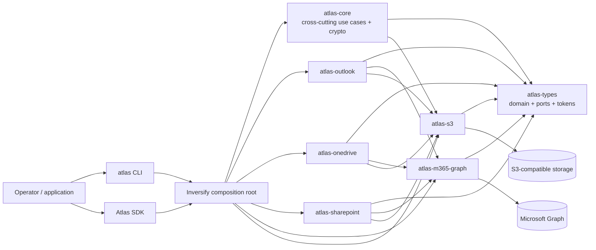
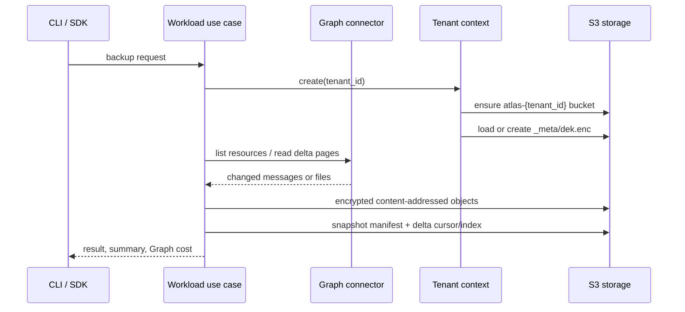
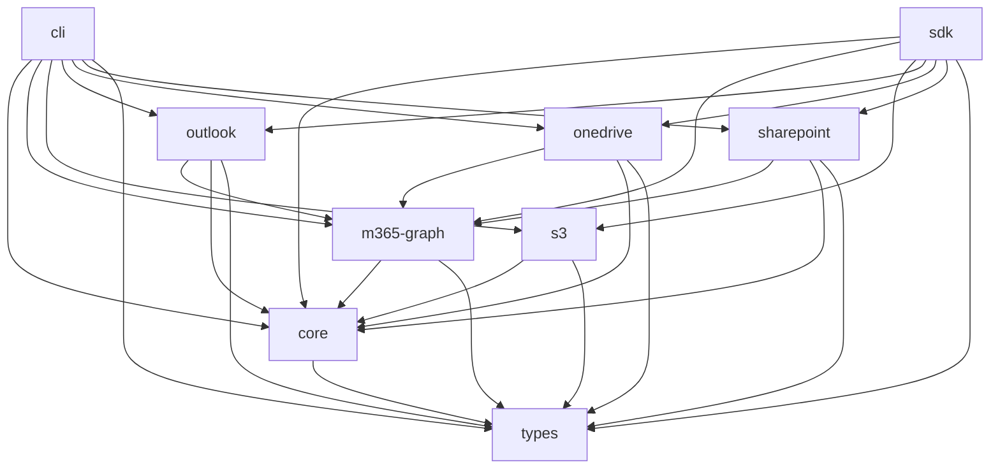

---
aliases:
  - Atlas Repo Map
tags:
  - atlas
  - architecture
  - repository-map
---

# Atlas repository map

> [!summary]
> Atlas is a pnpm/Turborepo TypeScript monorepo for encrypted Microsoft 365 backup, restore, verification, catalog, replication, and disaster recovery. Its two public entry points—CLI and SDK—compose the same Inversify container over shared ports, workload services, Microsoft Graph adapters, and S3-compatible storage.

Open [[atlas-repository-map.canvas|the architecture canvas]] for the spatial view.

## Start here

| Goal | Entry point |
| --- | --- |
| Understand the product | [README](../README.md), [concepts](../docs/concepts.md) |
| Trace CLI startup | [`packages/cli/src/cli.ts`](../packages/cli/src/cli.ts), [`packages/cli/src/container.ts`](../packages/cli/src/container.ts) |
| Trace SDK startup | [`packages/sdk/src/atlas-instance.adapter.ts`](../packages/sdk/src/atlas-instance.adapter.ts), [`packages/sdk/src/container.ts`](../packages/sdk/src/container.ts) |
| Find contracts and DI tokens | [`packages/types/src`](../packages/types/src), [`ports/index.ts`](../packages/types/src/ports/index.ts) |
| Understand storage and encryption | [storage layout](../docs/operations/storage-layout.md), [`tenant-context.factory.ts`](../packages/s3/src/adapters/tenant-context.factory.ts) |
| Find developer rules | [CONTRIBUTING](../CONTRIBUTING.md), [`eslint.config.js`](../eslint.config.js), [`.prettierrc`](../.prettierrc) |
| Find user-facing behavior | [CLI reference](../docs/reference/cli.md), [SDK reference](../docs/reference/sdk.md) |

## Runtime architecture

The CLI and SDK bind packages in the same order: configuration → Graph → S3 → core → cached identity resolution → Outlook → OneDrive → SharePoint. OneDrive and SharePoint explicitly require the S3-provided `TENANT_CONTEXT_FACTORY_TOKEN` to be bound first.

## Backup path

Key invariants:

- One S3 bucket per tenant: `atlas-{tenant_id}`.
- The tenant data-encryption key is wrapped and stored at `_meta/dek.enc`.
- Backup data is encrypted before persistence and addressed by SHA-256 plaintext hashes for deduplication.
- Snapshot manifests describe point-in-time state; delta cursors drive incremental sync.
- `TenantContext.destroy()` releases key material after an operation.

## Package map

Counts are current TypeScript/TSX files under each package's `src/` and `tests/` directories.

| Package | Role | Source / test files | Primary landmarks |
| --- | --- | ---: | --- |
| `@wisecom/atlas-types` | Dependency-free domain models, port interfaces, DI tokens, SDK contracts | 66 / 1 | [`domain/`](../packages/types/src/domain), [`ports/`](../packages/types/src/ports) |
| `@wisecom/atlas-core` | Shared catalog, deletion, verification, stats, replication, identity cache, rate limiting, envelope encryption | 47 / 27 | [`container.ts`](../packages/core/src/container.ts), [`services/`](../packages/core/src/services), [`adapters/keystore/`](../packages/core/src/adapters/keystore) |
| `@wisecom/atlas-m365-graph` | Authenticated Graph client, identity resolver, error handling, request rate limiting | 6 / 2 | [`container.ts`](../packages/m365-graph/src/container.ts), [`rate-limited-graph-connector.adapter.ts`](../packages/m365-graph/src/rate-limited-graph-connector.adapter.ts) |
| `@wisecom/atlas-s3` | S3 client, tenant buckets, encrypted tenant context, object/manifest repositories, storage checks | 16 / 6 | [`container.ts`](../packages/s3/src/container.ts), [`adapters/`](../packages/s3/src/adapters) |
| `@wisecom/atlas-outlook` | Mailbox discovery, delta backup, restore, save, status | 31 / 22 | [`container.ts`](../packages/outlook/src/container.ts), [`services/backup/`](../packages/outlook/src/services/backup), [`adapters/`](../packages/outlook/src/adapters) |
| `@wisecom/atlas-onedrive` | Per-owner drive backup, catalog, verify, restore, save, status; large-file streaming | 29 / 5 | [`container.ts`](../packages/onedrive/src/container.ts), [`services/`](../packages/onedrive/src/services), [`adapters/`](../packages/onedrive/src/adapters) |
| `@wisecom/atlas-sharepoint` | Per-site/library backup, catalog, verify, restore, save, status; large-file streaming | 32 / 9 | [`container.ts`](../packages/sharepoint/src/container.ts), [`services/`](../packages/sharepoint/src/services), [`adapters/`](../packages/sharepoint/src/adapters) |
| `@wisecom/atlas-cli` | Commander commands, Ink dashboards, terminal adapters; public `atlas` binary | 46 / 12 | [`cli.ts`](../packages/cli/src/cli.ts), [`commands/`](../packages/cli/src/commands), [`ui/`](../packages/cli/src/ui) |
| `@wisecom/atlas-sdk` | Public `createAtlasInstance`, workload API factories, camelCase boundary | 7 / 2 | [`sdk.ts`](../packages/sdk/src/sdk.ts), [`atlas-instance.adapter.ts`](../packages/sdk/src/atlas-instance.adapter.ts) |

## Package dependency graph

Solid arrows represent workspace package dependencies. CLI and SDK bundle internal packages through build-time workspace dependencies.

## Capability ownership

| Capability | Owning package / path |
| --- | --- |
| CLI command registration | [`packages/cli/src/commands`](../packages/cli/src/commands) |
| SDK public surface | [`packages/sdk/src/sdk.ts`](../packages/sdk/src/sdk.ts), [`packages/types/src/ports`](../packages/types/src/ports) |
| Shared catalog, verify, delete, stats, replicate | [`packages/core/src/services`](../packages/core/src/services) |
| Outlook mailbox backup orchestration | [`mailbox-sync.service.ts`](../packages/outlook/src/services/backup/mailbox-sync.service.ts) |
| OneDrive backup orchestration | [`onedrive-backup.service.ts`](../packages/onedrive/src/services/onedrive-backup.service.ts) |
| SharePoint backup orchestration | [`sharepoint-backup.service.ts`](../packages/sharepoint/src/services/sharepoint-backup.service.ts) |
| Graph authentication and throttling | [`packages/m365-graph/src`](../packages/m365-graph/src) |
| S3 client and tenant storage | [`packages/s3/src/adapters`](../packages/s3/src/adapters) |
| Encryption/key derivation | [`packages/core/src/adapters/keystore`](../packages/core/src/adapters/keystore) |
| Performance tooling | [`tools/perf`](../tools/perf) |
| Operator documentation | [`docs`](../docs) |
| Local MinIO setup | [`docker`](../docker) |
| CI | [`.github/workflows`](../.github/workflows) |

## User-facing surfaces

- **CLI workloads:** `atlas outlook`, `atlas onedrive`, `atlas sharepoint`.
- **Cross-cutting CLI operations:** `storage-check`, `stats`, `replicate`, `rehydrate`, `list-users`.
- **SDK:** `createAtlasInstance()` returns `outlook`, `onedrive`, and `sharepoint` sub-APIs plus tenant-wide storage, statistics, identity, and replication methods.

## Development topology

- **Workspace:** pnpm 10 + Turborepo.
- **Runtime:** Node.js 22+, ESM, TypeScript 5.9.
- **Build:** `tsc` for internal packages; `tsdown` for publishable CLI/SDK bundles.
- **Tests:** Vitest, package-local `tests/unit/`.
- **Quality:** ESLint + Prettier; 300 effective lines maximum per file.
- **Docs:** VitePress from `docs/`.
- **Local storage:** Docker Compose runs S3-compatible MinIO.

## Change routing

1. Change a contract or token in `atlas-types` first.
2. Change orchestration in the owning workload or `atlas-core` service.
3. Change external I/O in `m365-graph` or `s3` adapters.
4. Bind implementations at the package `container.ts` and both composition roots when needed.
5. Expose public behavior through CLI commands and/or SDK factories.
6. Mirror behavior tests under the owning package's `tests/unit/` and update the matching `docs/` reference page.
